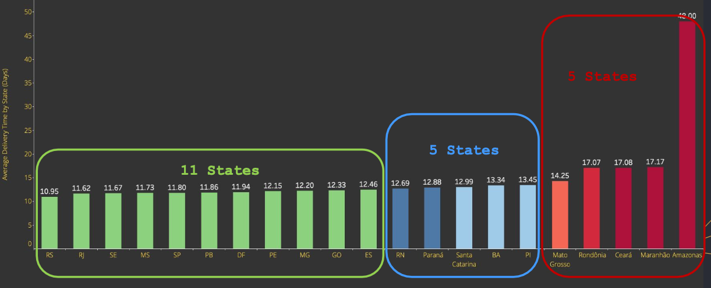

# **Eniac Brazil Market Expansion**

## **Purpose**

### **Problem Statement:**
Eniac, a high-end tech product company, is expanding into the Brazilian market. A crucial part of this expansion is securing a reliable delivery partner capable of efficiently handling high-value tech products. The company has evaluated **Magist**, a Brazilian delivery company, and obtained its data for analysis.

### **Solution:**
A detailed analysis was conducted on **Magist’s** suitability as a logistics partner. This includes:
- **Customer review sentiment analysis** to understand user satisfaction.
- **Delivery time evaluation** to assess efficiency.
- **Performance comparison across different states.**

The findings help determine whether Magist meets the standards required for delivering Eniac’s products efficiently and reliably.


## **Summary**
This project evaluates **Magist**, a potential delivery partner for Eniac, through data analysis focusing on customer reviews, delivery efficiency, and state-wise performance. The goal is to ensure a reliable logistics network for high-value tech products in Brazil.


## **Data Analysis & Findings**

### **1. Market Share of High-Value Tech Products**
- Only **18.4%** of high-value products sold in Brazil were Tech-related products.

  

- **General customer reviews**:
  - **Positive:** 76.8%
  - **Neutral:** 14.9%
  - **Negative:** 8.3%

  

- **Tech-product specific reviews:**
  - **Positive:** 76.3%
  - **Neutral:** 8.7%
  - **Negative:** 15.0%

  

### **2. Delivery Time Analysis**
- Average delivery time for all products: **12 days**
- Seasonal fluctuations show improvement over time, even during public holidays in the year **2018**.


  

### **3. State-wise Performance & Sales Impact**
- **11 states** show strong delivery performance.
- **5 states** have moderate delivery efficiency.
- **5 states** perform poorly in delivery timelines.
- **Amazonas & Ceará** show negligible sales, indicating their irrelevance for expansion.

  

### **4. Impact of Late Deliveries on Customer Reviews**
- Products Delivered within 10 days of placing orders resulted in a 5-star (Excellent) ratings from Customer. 
- This finding also hold true when data is filtered, based on tech-products.
- Direct correlation between **lower delivery time** and **higher customer satisfaction**.

  


## **Key Learnings**
- **Technical Insights:** Data-driven decision-making improves logistics planning.
- **Business Strategy:** A strong delivery network and the delivery time of under 10 days is crucial for customer satisfaction and expansion.
- **Communication:** Translating data analysis into actionable business insights was a key aspect of this project.


## **Challenges Overcame**
- **Limited Data on High-End Tech Products:** Addressed by tackling problem from a different perspective and segmenting data accordingly.
- **Customer Reviews Analysis:** Used customer reviews as one of the basis of analysis to understand general customer sentiment towards Magist.
- **State-Wise Disparity in Delivery Efficiency:** Focused on identifying problem areas and assessing their impact.
- **Seasonal Variability in Delivery Performance:** Used historical data trends to compare sales fluctuations during the year 2017-2018.


## **Additional Reflections**
- Further **data collection** on high-end tech product sales is necessary for long-term planning.
- **Scalability** of Magist’s logistics remains uncertain and needs periodic review.
- **Alternative logistics providers** could be benchmarked to compare performance.


## **Repository Contents**
- **Presentation Slides:** Detailed breakdown of findings and visual representation.
- **Data Analysis Reports:** Supplementary data used for decision-making.
- **README File:** Overview of the study and findings.


## **Deployment & Contribution**
### **How to Use This Repository:**
1. Clone the repository:
   ```sh
   git clone https://github.com/yourusername/eniac-brazil-market.git
   ```
2. Navigate to the project folder:
   ```sh
   cd eniac-brazil-market
   ```
3. View the presentation and analysis reports.


### **Contributions:**
- If you have insights or alternative recommendations, feel free to submit a pull request or open an issue.
- Further data analysis and insights are welcome to refine decision-making.


## **Languages and Libraries Used**
- **Programming Languages:** SQL
- **Tools:** VScode, Tableau, Google Slides


## **Credits**
- **Data Sources:**
  - Patently Apple
  - Statista
  - StatCounter
  - Digital Watch
- **Analysis Conducted by:** [Prakash Joshi]


# **Acknowledgements**

Special thanks to my mentor and instructor 'Sabine Joseph' for providing me with various materials and her valuable pointers.


